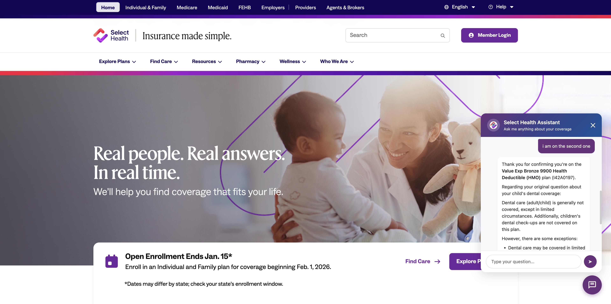

# sbc-chatbot

## Project layout

- `app.py`: Dash app + chat UI + Databricks invocation logic.
- `requirements.txt`: Python dependencies.
- `app.yaml`: Runtime entry (runs `python app.py` in compatible platforms that honor this config).
- `assets/`: Static assets (images, svg, css) used by Dash.

## Agent Bricks: Knowledge Assistant documentation

[Knowledge Assistant (Agent Bricks)](https://learn.microsoft.com/en-us/azure/databricks/generative-ai/agent-bricks/knowledge-assistant)

